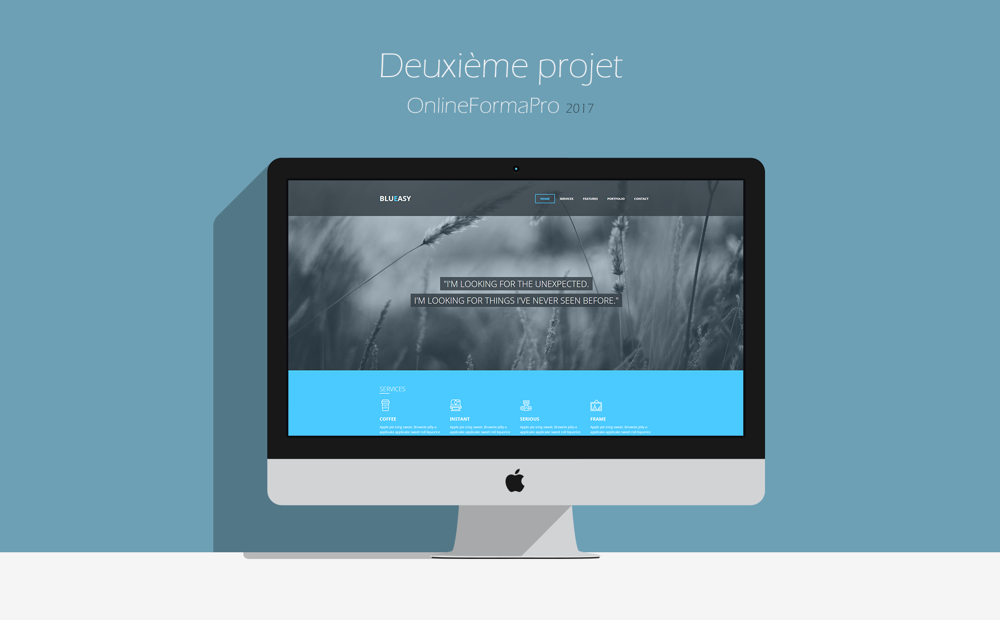
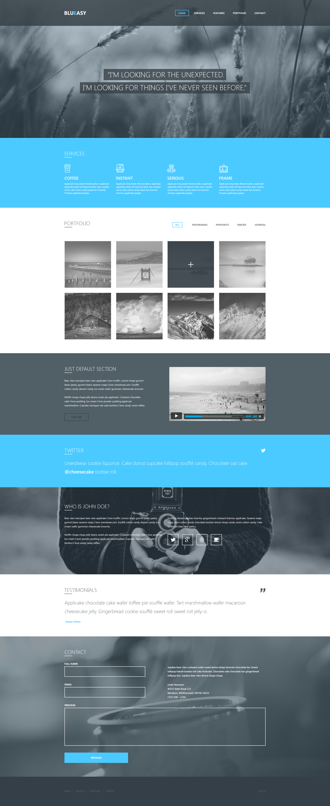

<h2># Projet2OFP</h2>
2ème Projet au sein du centre de formation OnlineFormaPro  

<h4>La maquette à intégrer:</h4>

<h3>Exercice:</h3>
<ol>
  <li>Réaliser un site à partir d'une maquette.</li>
</ol>

Le site n'est pas responsive car ce n'était pas le but de l'éxercice.

Projet réalisé par: <a href="http://clairegiacomel.com/" target="_blank">Claire Giacomel</a>, Ponçon Elodie, Bojama Mélissa, Sautebin Anthony.

<h4>Résultat:</h4>
<a href="https://anthonyaes.github.io/projectNCAM/">Github Pages</a>
